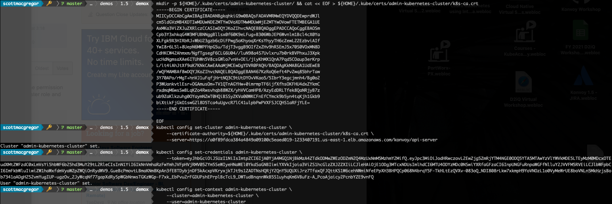

# D2iQ - Konvoy LDAP connection to FreeIPA/LDAP

## Summary 

You can easily hook Dex to provide ldap functionality to Konvoy. 

### Dex

`Dex` is deployed as an `addon` in Konvoy

* (private) https://github.com/mesosphere/dex/blob/v2.22.0-mesosphere/Documentation/connectors/ldap.md


Note:  You can **not** use the `./extras/kubernetes` folders for automation, because addons are fired after 
ansible's `STAGE [Deploying Additional Kubernetes Resources]`

### Tutorial

There is a somewhat incomplete tutorial using a different open ldap demo server.

* https://docs.d2iq.com/ksphere/konvoy/1.4/security/external-idps/howto-dex-ldap-connector/

There are other tutorials using OAuth (watch out for the age of the konvoy references)

* https://github.com/mesosphere/konvoy-training#appendix-1-setting-up-an-external-identity-provider

## Deploying Manifest to Konvoy

The `manifests/ldap/` define some basic configuration for the ldap binding.

```shell
$ kubectl apply -f manifests/
secret/ldap-password configured
connector.dex.mesosphere.io/ldap unchanged
clusterrolebinding.rbac.authorization.k8s.io/cluster-admin-ldapadmin unchanged
clusterrole.rbac.authorization.k8s.io/prom-admin unchanged
clusterrolebinding.rbac.authorization.k8s.io/prom-rbac created
```


## D2iQ Ksphere Konvoy 1.5.x using correctly configured LDAP 

### Authenticated for `kubectl` Token use

Requesting Configurations for using ldap `admin` in `kubectl`.


Setting `kubectl` config using ldap `admin` .



Using `admin-kubernetes-cluster` context in `kubectl` config using ldap `admin`.


### Authenticated for Opsportal use

Login using the LDAP TEST.


Fully authenticated and authorized using ldap `admin` in `kubectl`.


### Authentication using the `konvoy-async-auth` plugin

When enabled the plugin initiates authentication sessions and stores identity tokens automatically.

As an example, Im going to want to go to `/token/plugin` in 1.5.x konvoy.

https://a7e20fc00e6314114b65bd8eb65cdcaf-67797667.us-east-1.elb.amazonaws.com/token/plugin

Konvoy kubectl credentials plugin

This document describes the process of configuring kubectl to use the Konvoy credentials plugin. This credentials plugin makes it easy to use external identity provider accounts with the kubernetes API. When enabled the plugin initiates authentication sessions and stores identity tokens automatically.

* Generate a kubeconfig
* Configure Access to Multiple Clusters
* Build kubeconfig with kubectl
* Copy cluster CA certificate
* Download and Install Konvoy credentials plugin
* Configure kubectl to use the Plugin
* Create a cluster configuration
* Create kubeconfig user Profile
* Create the context
    
If this is the first time you've attempted to authenticate using the plugin, a browser window opens to the Konvoy authentication page. After successful authentication, you should see a pod listing in your terminal. The plugin stores your identity token for subsequent requests. After your identity token expires, by default 24 hours, the plugin directs you to the Konvoy authentication page where you can re-authenticate.

### Set additional RBACS

Grant the user `opsportal-admin` role

```
$ kubectl describe clusterroles opsportal-admin
describe clusterroles opsportal-admin
Name:         opsportal-admin
Labels:       app.kubernetes.io/instance=opsportal-kubeaddons
              app.kubernetes.io/managed-by=Tiller
              app.kubernetes.io/version=1.0.0
Annotations:  <none>
PolicyRule:
  Resources  Non-Resource URLs  Resource Names  Verbs
  ---------  -----------------  --------------  -----
             [/ops/portal/*]    []              [delete]
             [/ops/portal]      []              [delete]
             [/ops/portal/*]    []              [get]
             [/ops/portal]      []              [get]
             [/ops/portal/*]    []              [head]
             [/ops/portal]      []              [head]
             [/ops/portal/*]    []              [post]
             [/ops/portal]      []              [post]
             [/ops/portal/*]    []              [put]
             [/ops/portal]      []              [put]
```             

* More RBAC in the Portal: https://docs.d2iq.com/ksphere/konvoy/1.5.0-beta/security/external-idps/rbac/

### Authenticated into Kommander with Federation

(Fix this) Fully authenticated and authorized using "admin" in "opsportal".


## Refresh Credentials 

When the token expires, it is necessary to repeat the above process to obtain a fresh token. When refreshing a token, only the `kubectl config set-credentials ... --token=ABCCC` command needs to be executed with the new token.

Also see: ***Authentication using the `konvoy-async-auth` plugin***

## Troubleshooting Konvoy

### Find the `Dex` pods

Use the `kubeaddons` namespace when looking for them:

```shell
$ kubectl get pods --namespace kubeaddons |grep ^dex
dex-k8s-authenticator-kubeaddons-57bcc8f449-xvr7n                 1/1     Running     2          3h2m
dex-kubeaddons-dd869fc8f-j4xcf                                    1/1     Running     0          2m42s
dex-kubeaddons-dex-controller-6b6c9fbd7f-sscb7                    2/2     Running     0          3h39m
```

### Issues with Binding 

There are two or three issues covered in here:

https://docs.d2iq.com/ksphere/konvoy/1.4/security/external-idps/howto-dex-ldap-connector/

### `Not Authorized` is not the same as `Not Authenticated!`

This is actually not an error, but a permissions issue.

`admin` Did actually login! **You need to fix RBAC.**

```
$ kubectl logs -f dex-kubeaddons-dd869fc8f-j4xcf -n kubeaddons
time="2020-05-04T20:19:36Z" level=info msg="performing ldap search cn=users,cn=accounts,dc=demo1,dc=freeipa,dc=org sub (&(objectClass=person)(uid=admin))"
time="2020-05-04T20:19:36Z" level=info msg="username \"admin\" mapped to entry uid=admin,cn=users,cn=accounts,dc=demo1,dc=freeipa,dc=org"
time="2020-05-04T20:19:36Z" level=info msg="performing ldap search cn=groups,cn=accounts,dc=demo1,dc=freeipa,dc=org sub (&(objectClass=groupofnames)(uniqueMember=uid=admin,cn=users,cn=accounts,dc=demo1,dc=freeipa,dc=org))"
time="2020-05-04T20:19:36Z" level=error msg="ldap: groups search with filter \"(&(objectClass=groupofnames)(uniqueMember=uid=admin,cn=users,cn=accounts,dc=demo1,dc=freeipa,dc=org))\" returned no groups"
time="2020-05-04T20:19:36Z" level=info msg="login successful: connector \"dex-controller-ldap\", username=\"\", preferred_username=\"\", email=\"admin\", groups=[]"
```


### `Not Authenticated` but binding works

This is very simple, you are use the wrong password for the current user.


